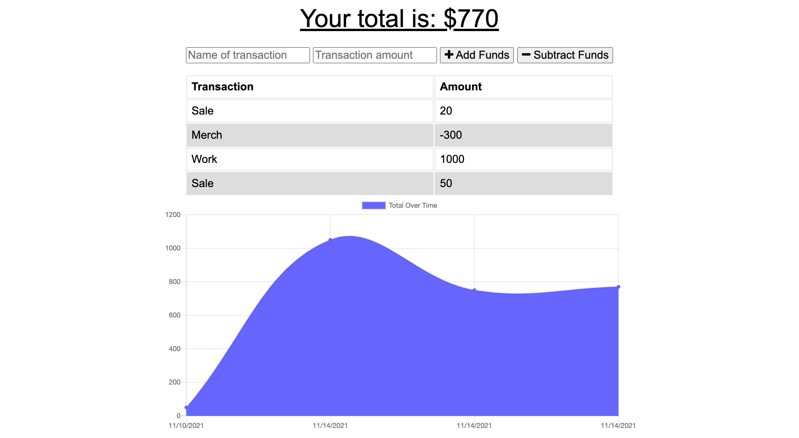

# Budget Tracker

## Objectives
The user will be able to add expenses and deposits to their budget with or without a connection. When entering transactions offline, they should populate the total when brought back online.

## Screenshot

## Link to GitHub Repo
[Link to the Github Repo](https://github.com/erikaosterbur/budget-tracker.git)

## Link to Deployed App on Heroku
[Link to the Deployed Page](https://erika-osterbur-budget-tracker.herokuapp.com/)